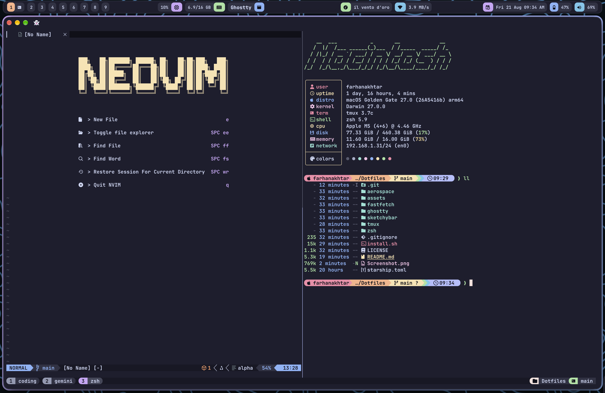

# macOS Dotfiles

A clean, modern, and reproducible macOS dotfiles setup featuring **AeroSpace** (tiling window manager), **SketchyBar** (status bar), **Ghostty** (GPU-accelerated terminal), **Tmux** (terminal multiplexer), **Starship** (cross-shell prompt), and **Fastfetch** — all unified with the **Catppuccin Mocha** color scheme and XDG directory standards.



> [!WARNING]
> SketchyBar's spacing, padding, and item widths are tuned for a 13" MacBook Air
> display. On other screen sizes it may look cramped, overly spread out, or
> misaligned — you'll likely need to tweak sketchybar/colors.sh and the item
> widths in sketchybar/items/ to match your display.

---

## ⚡ Features & Components

- **Window Manager**: [AeroSpace](https://github.com/nikitabobko/AeroSpace) — i3-like tiling window manager for macOS with borders.
- **Status Bar**: [SketchyBar](https://github.com/FelixKratz/SketchyBar) — Highly customizable macOS status bar with workspaces, media, resource monitors, and smooth animations.
- **Terminal**: [Ghostty](https://ghostty.org/) — Ultra-fast, native GPU-accelerated terminal.
- **Multiplexer**: [Tmux](https://github.com/tmux/tmux) + [TPM](https://github.com/tmux-plugins/tpm) — Seamless navigation, session persistence, and Catppuccin status line.
- **Shell**: [Zsh](https://www.zsh.org/) + [Starship](https://starship.rs/) — Full XDG compliance (`ZDOTDIR=~/.config/zsh`), fast startup, autosuggestions, and syntax highlighting.
- **Fetch Utility**: [Fastfetch](https://github.com/fastfetch-cli/fastfetch) — Instant system overview with custom ASCII art.

---

## 📦 What Gets Installed & Symlinked

Every configuration is symlinked from this repository to `~/.config/` so changes in the repo stay live immediately.

| Component | Repo Path | Target Symlink | Purpose |
|---|---|---|---|
| **AeroSpace** | `aerospace/aerospace.toml` | `~/.config/aerospace/aerospace.toml` | Tiling window management rules, gaps, and keybindings |
| **Fastfetch** | `fastfetch/` | `~/.config/fastfetch/` | ASCII art logo & system information layout |
| **Ghostty** | `ghostty/config.ghostty` | `~/.config/ghostty/config` | Font configuration, Catppuccin Mocha theme, window styles |
| **SketchyBar** | `sketchybar/` | `~/.config/sketchybar/` | Status bar geometry, items, and shell plugin scripts |
| **Starship** | `starship.toml` | `~/.config/starship.toml` | Multi-module prompt theme and palette |
| **Tmux** | `tmux/tmux.conf` | `~/.config/tmux/tmux.conf` | Tmux prefix (`Ctrl+a`), window splits, vim-tmux-navigator |
| **Zsh** | `zsh/*` | `~/.config/zsh/*` | `.zshrc`, `.zprofile`, aliases, and integrations |
| **Zsh Env** | *(generated)* | `~/.zshenv` | Sets `export ZDOTDIR="$HOME/.config/zsh"` (single root exception) |

---

## 🛠️ Prerequisites

- **macOS** (Apple Silicon or Intel)
- **Homebrew** (the installer will automatically install Homebrew if missing)

---

## 🚀 One-Line Installation

Clone the repository and run the automated installer:

```bash
git clone https://github.com/farhanakhtar0x66/dotfiles.git ~/Coding/Dotfiles && cd ~/Coding/Dotfiles && ./install.sh
```

### What `install.sh` Does

1. **Safety First**: Verifies macOS environment and backs up existing configs to `~/.dotfiles-backup/<timestamp>/`.
2. **Package Installation**: Installs required formulae and casks via Homebrew (SketchyBar, JankyBorders, AeroSpace, Ghostty, Starship, Fastfetch, Tmux, JetBrains Mono Nerd Font, etc.).
3. **Symlinking**: Creates symlinks to `~/.config/` with zero copying.
4. **Plugin Management**: Bootstraps TPM (Tmux Plugin Manager) and installs all defined Tmux plugins.
5. **Permissions**: Ensures all executable shell scripts receive proper permissions (`chmod +x`).
6. **Idempotency**: Safe to run repeatedly — skips already-satisfied packages, links, and configs.

---

## 🎨 Customization

### SketchyBar Theme & Colors
Edit `sketchybar/colors.sh` to modify color hex codes, font families, and animation curves:
```bash
# Palette specification in sketchybar/colors.sh
export BAR_COLOR=0xff1e1e2e
export TEXT_COLOR=0xffcdd6f4
export SURFACE_COLOR=0xff313244
```
Apply updates instantly:
```bash
sketchybar --reload
```

### Catppuccin Flavor (Tmux)
Change the flavor in `tmux/tmux.conf`:
```tmux
set -g @catppuccin_flavor 'mocha' # latte, frappe, macchiato, or mocha
```
Reload Tmux within a session using `Prefix + I` or `tmux source ~/.config/tmux/tmux.conf`.

### AeroSpace Keybindings & Gaps
Customize your workspaces, modifiers, and application bindings in `aerospace/aerospace.toml`. Reload with:
```bash
aerospace reload-config
```

---

## 🔄 Uninstallation

To remove all created symlinks and automatically restore your previous configuration backup:

```bash
./install.sh --uninstall
```

---

## 🤝 Credits & Acknowledgements

- **Theme**: [Catppuccin](https://github.com/catppuccin/catppuccin)
- **Window Management**: [AeroSpace](https://github.com/nikitabobko/AeroSpace) by Nikita Bobko
- **Status Bar & Borders**: [SketchyBar](https://github.com/FelixKratz/SketchyBar) & [JankyBorders](https://github.com/FelixKratz/JankyBorders) by Felix Kratz
- **Terminal**: [Ghostty](https://ghostty.org/) by Mitchell Hashimoto
- **Prompt**: [Starship](https://starship.rs/)
- **System Info**: [Fastfetch](https://github.com/fastfetch-cli/fastfetch)
- **Tmux Plugins**: [TPM](https://github.com/tmux-plugins/tpm), [tmux-sensible](https://github.com/tmux-plugins/tmux-sensible), [vim-tmux-navigator](https://github.com/christoomey/vim-tmux-navigator)

---

## 📄 License

Distributed under the [MIT License](LICENSE).
